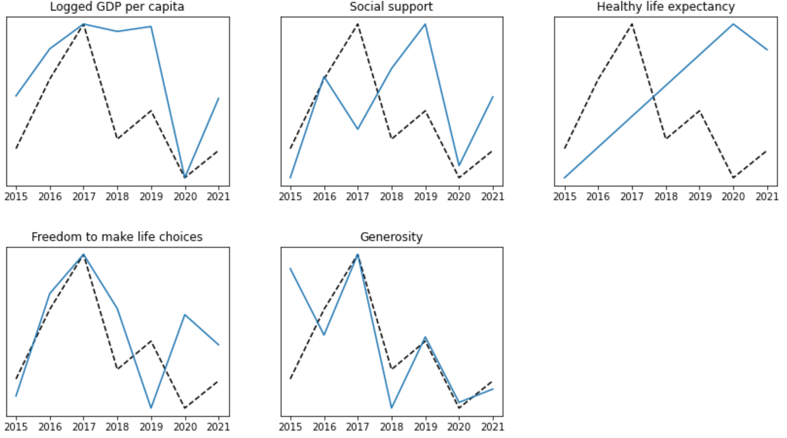
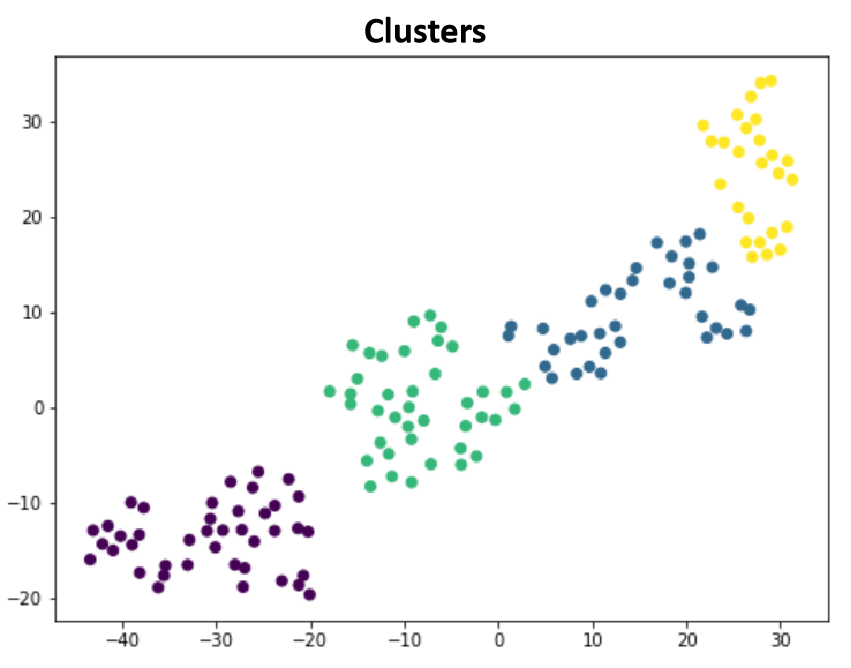
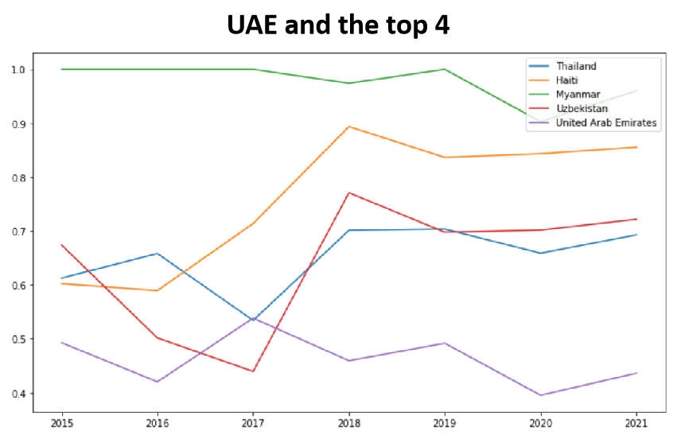

# United Arab Emirates and the World Happiness Report 2021

The World Happiness Report is a yearly publication of the United Nations Sustainable Development Solutions Network. 

It contains articles and rankings of national happiness, based on respondent ratings of their own lives, which the report also correlates with various life factors.

The data of present and former years is available for free, and we will use this data to generate some insights about happiness in the United Arab Emirates.

We will correlate the happiness of a country with several factors:

Additionally, we will identify what is the most important factor the UAE Government should address to increase the population's happiness.

Finally, we will cluster the countries, to discover which countries has been more succesfull in improving that important factor:

## References

- Dataset: www.kaggle.com/ajaypalsinghlo/world-happiness-report-2021
- Report: https://worldhappiness.report
- Ministry of Happiness: u.ae/en/about-the-uae/the-uae-government/government-of-future/happiness
- UAE Demographics: www.globalmediainsight.com/blog/uae-population-statistics
- Generosity survey: www.cafonline.org/docs/default-source/about-us-publications/caf_worldgivingindex2015_report.pdf?sfvrsn=2
- Data Science Algorithms: scikit-learn.org
- Statistical Theory: online.stat.psu.edu
- Experimental Design: imaging.mrc-cbu.cam.ac.uk/statswiki/FAQ/Simon
- Interpolation: en.wikipedia.org/wiki/Linear_interpolation